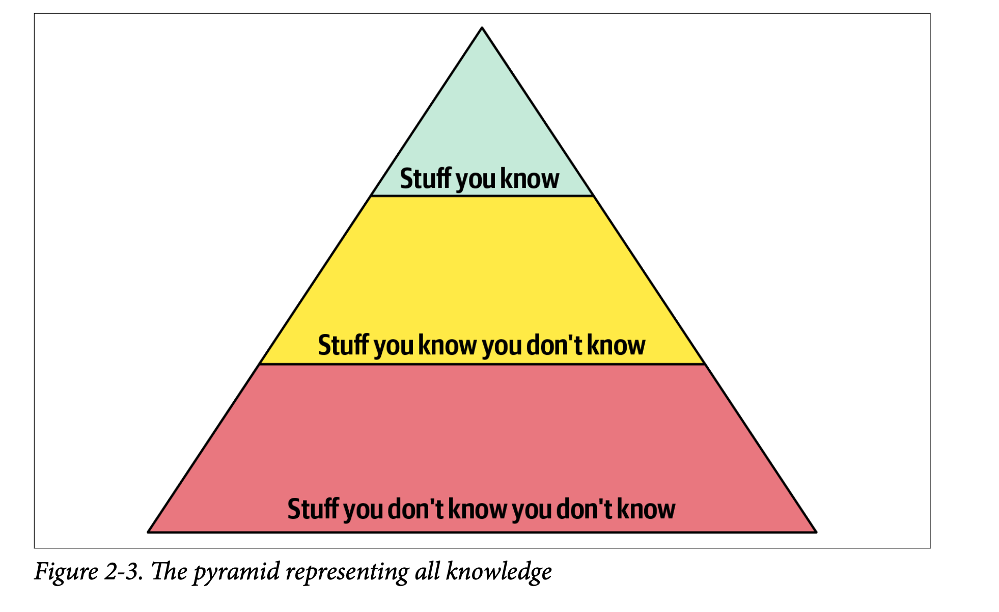

> **Note**: This blog post is based on my personal notes but rewritten and restructured by AI.

# Chapter 2: Architectural Thinking

This chapter explores the mindset shift necessary to think like a software architect. It centers on **four core facets** that define architectural thinking.

---

## Architecture Versus Design

- Traditionally, architects focused on high-level concerns such as defining **architectural characteristics** (e.g., "-ilities"), selecting architectural patterns, and designing system components—the foundational "building blocks." These artifacts were then "handed off" to development teams.
- Developers handled lower-level details, including class diagrams, UI screens, source code development, and testing.
- The chapter emphasizes that this **"old-school Waterfall approach"**—where architecture is static and rigid—**no longer works**. Modern architectures are dynamic and continuously evolving, requiring **"tight collaboration between the architect and the development team."**
- The authors advocate **breaking down "physical and virtual barriers"** between architects and developers, fostering a **"strong bidirectional relationship"** where both are part of the "same virtual team." This enables continuous synchronization because architecture and design are "deeply intertwined."

---

## Technical Breadth

**Technical Breadth** distinguishes a software architect's knowledge from that of a developer.

- A **developer** needs deep expertise in a specific area, such as mastering a particular programming language or tool.
- An **architect** must have a broad understanding of many technologies and solutions, prioritizing knowledge of *multiple ways* to solve problems over deep expertise in a single technology.

Knowledge can be visualized as a pyramid with three layers:

1. **Deep knowledge:** What you know well (e.g., Java expertise for a Java developer).
2. **Known unknowns:** Technologies you've heard of but aren't expert in (e.g., awareness of Clojure).
3. **Unknown unknowns:** Technologies or ideas you haven't encountered but might be ideal solutions.

As one transitions from developer to architect:
- The focus shifts from depth to breadth.
- The top two layers (what you know and what you know you don't know) become increasingly important.
- It's normal to trade some depth for breadth.

**Why this matters:** Architects who fail to broaden their knowledge risk falling into **"stale expertise"** or the **"Frozen Caveman Anti-Pattern,"** where outdated solutions persist simply due to familiarity.

**Maintaining breadth:**
- Allocate time daily for learning new things (e.g., the **"20-minute rule"**).
- Use resources like **InfoQ**, **DZone Refcardz**, and the **ThoughtWorks Technology Radar**.

**Bottom line:** Broad technical knowledge equips architects to identify more solutions and make smarter design decisions.

---

## Analyzing Trade-Offs

Architectural thinking requires recognizing and evaluating *trade-offs* in every solution.

> **"Architecture is the stuff you can't Google."** – Mark Richards

There is no universal "best" answer for architectural decisions because solutions depend on context, including deployment environment, business drivers, company culture, budget, timeframes, and team skills.

> **"Programmers know the benefits of everything and the trade-offs of nothing. Architects need to understand both."** – Rich Hickey

> **"There are no right or wrong answers in architecture—only trade-offs."** – Neal Ford

For example, choosing between **topics** (publish-subscribe) and **queues** (point-to-point) messaging in an auction system involves trade-offs:
- **Topics** offer greater *extensibility* and *decoupling* but sacrifice *security*, *heterogeneous data support*, and *monitoring/scalability*.
- The best choice depends on priorities like flexibility versus security or scalability versus ease of change.

**Key takeaway:** Great architects weigh trade-offs carefully, selecting solutions that best fit their specific context rather than blindly adopting popular options.

---

## Understanding Business Drivers

Architects must understand the business drivers underpinning a system's success and translate these into architectural characteristics such as scalability, performance, and availability. This requires domain knowledge and collaboration with stakeholders to identify, qualify, and measure these characteristics against business needs.

---

## Balancing Architecture and Hands-On Coding

### Core Idea

A successful architect maintains technical depth through hands-on coding while avoiding becoming a bottleneck.

---

### Strategies to Balance Coding and Architecture

1. **Avoid becoming a bottleneck:**
   - Do not own critical-path or framework code that slows team progress.
   - Instead, code business functionality a few iterations ahead to:
     - Stay connected to production code.
     - Empower the team to own complex critical components.
     - Relate to the team's challenges.

2. **Stay hands-on without blocking development:**
   - Build **Proof-of-Concepts (POCs)** to evaluate new technologies; always write production-quality code since POCs often evolve into the codebase.
   - Address **technical debt** or **architecture stories**, which have lower priority.
   - Fix bugs to understand system weaknesses while supporting the team.
   - Automate repetitive tasks by creating scripts or tools (e.g., lint checks, refactoring tools, architecture compliance).
   - Write architectural compliance tests using tools like **ArchUnit** or custom fitness functions.
   - Conduct frequent code reviews to ensure architecture alignment and mentor developers.

---

### Author's Key Message

- Architecture is not just about diagrams and meetings; continuous coding is essential to remain relevant and credible.
- Choose coding tasks that add value without impeding the team.
- Use coding to strengthen the system, guide the team, and keep skills sharp.

---

This summary distills the chapter's core concepts on architectural thinking, balancing breadth and depth, collaboration, trade-offs, and business alignment essential for effective software architecture.
