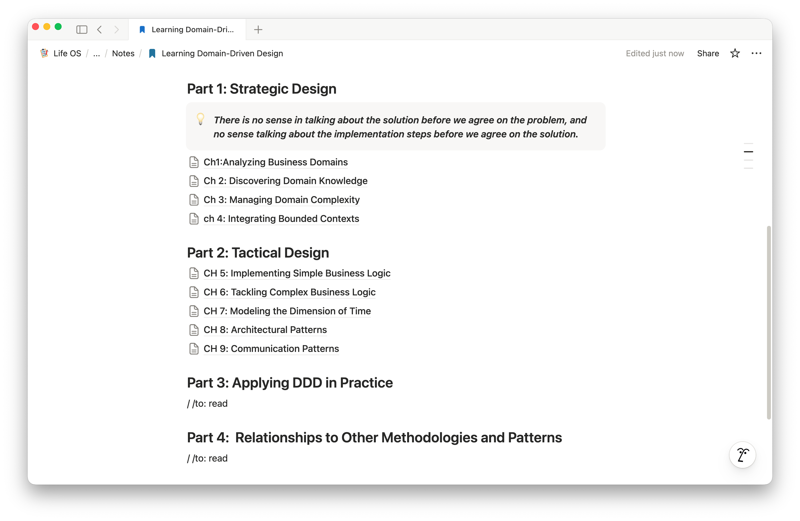
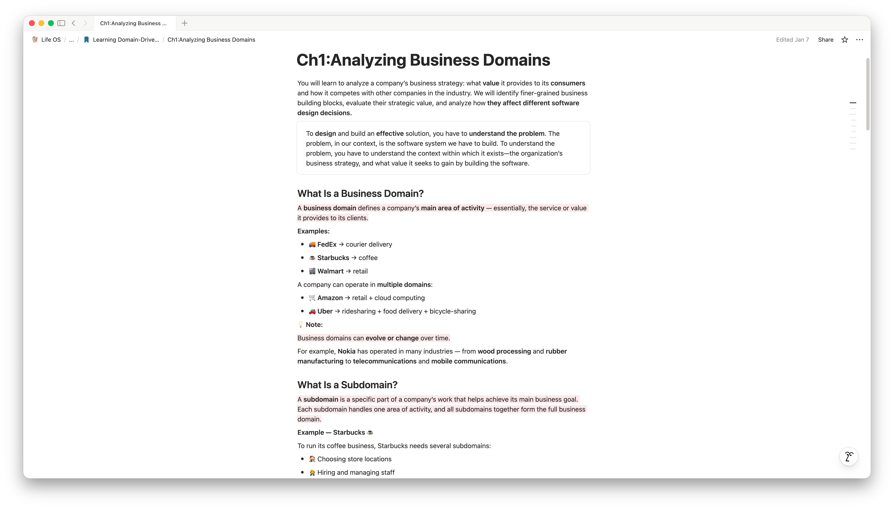

# How I Use LLMs to Summarize Books Faster

I'm someone who rarely goes back to reread a book. Because of that, I rely heavily on the notes I take while reading.

Whenever I read a book, I make sure to write notes in a clear and organized way, so when I return to them later, I can quickly find what I need. If the notes aren't enough, I always include references to the exact chapter and section where the idea came from.

For me, summarizing every chapter I read is essential.

The problem was that writing and organizing notes used to take a lot of time.

## Using LLMs for Summarization

Recently, instead of spending a long time writing notes myself, I started using LLMs to help with summarization. Of course, LLMs don't always produce the same quality output, which is where good prompts become critical.

After some experimentation, I created a prompt that works really well for me. I've been using it for about a month now, and I'm genuinely impressed with the quality of the notes. A chapter that used to take me 30 minutes to an hour to read and summarize (depending on its size) now takes roughly half the time.

More importantly, my focus has shifted back to reading itself. I read actively, scribble quick thoughts on paper, and no longer waste time formatting and organizing notes while reading.

## The Prompt

I'll share the prompt I use in case anyone finds it helpful:

```markdown
You are an expert academic note-taker and editor.

Produce a concise yet thorough summary of **Chapter [X] from [Book Title]**, 
suitable for long-term notes, review, and sharing.

### Goals
- Capture the chapter's **core ideas, arguments, and structure** without oversimplifying.
- Preserve the **author's terminology, concepts, and intent**.
- Retain important **rules, laws, principles, or formal definitions**, explained clearly in their proper context.
- Include enough detail to stand alone, while avoiding trivial or excessive information.

### Required Structure (Markdown)

Use clear, well-structured **Markdown**.

#### Overview
- A brief synthesis of the chapter's purpose and central themes.

#### Chapter Structure
- Create sections whose **headings match the concepts or sections introduced by the author**.
- Follow the **same order** as the chapter.
- For each section:
  - Explain the concept clearly.
  - Include related rules, laws, or principles **in context**.
  - Include high-value quotes **inline**, near the ideas they support, with brief explanation.

#### Connection to the Book
- Explain how this chapter builds on earlier chapters and prepares for later ones.

### Style & Constraints
- Clear, precise, professional tone.
- No personal opinions or external interpretations.
- Avoid unnecessary verbosity while retaining critical nuance.
- Optimized for **Obsidian and Notion** (clean Markdown, reviewable, and shareable).
```

## How I Organize Notes in Notion

I also use it to organize my notes in Notion. I have a database for all my book notes, where each note is about a book. Inside each book note, I have nested pages for each chapter.



And here's an example of what a chapter summary looks like:



So far, this feels like the most effective reading workflow I've found for myself.
